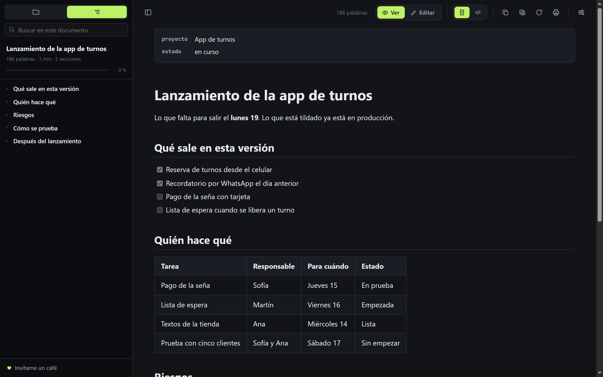
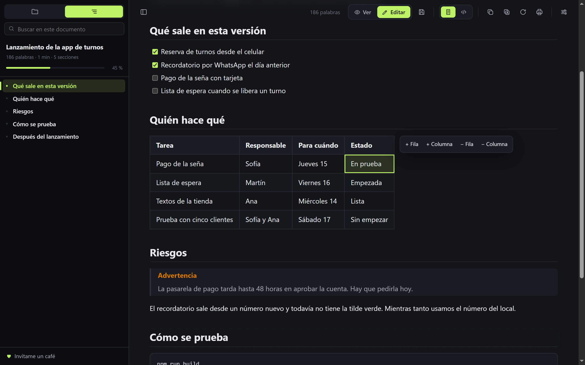

# MD Tools

[English](README.md) · Español





Extensión de Chrome para leer y editar archivos Markdown en el navegador, locales (`file://`) o servidos por web. Sin cuentas, sin planes pagos y sin llamadas a servidores: todo corre en la máquina.

## Qué hace

- **Edición en el lugar**: pasás a modo Edición y hacés clic en cualquier párrafo, título, ítem o celda para cambiarlo. Negrita, cursiva, tachado, código y enlaces desde una barrita o con los atajos de siempre; agregar y quitar filas y columnas; tildar tareas. El Markdown se reescribe por detrás, sin que veas la sintaxis. Se guarda con Ctrl+S, o con guardado automático.
- **Índice automático** del documento, con la sección actual resaltada mientras se hace scroll.
- **Árbol de carpetas**: los archivos Markdown de la carpeta del documento, con subcarpetas que se abren y botón para subir de nivel.
- **Recarga automática** cuando el archivo cambia en disco, sin perder la posición.
- **Tema** claro, oscuro o automático. Los colores de acento, la tipografía y el CSS propio son extras de agradecimiento para quienes apoyan el proyecto, y se liberan a palabra: no hay verificación. Todo lo que hace el lector y el editor es gratis.
- **Contenido centrado**, con **ancho**, **tamaño de letra**, **interlineado** y **tipografía** a medida.
- **CSS propio** encima del tema.
- **Plugins de Markdown**, cada uno con su interruptor: resaltado de código, emoji, subíndice y superíndice, insertado, marcado, abreviaturas, listas de definición, notas al pie, listas de tareas, alertas estilo GitHub, índice en el texto (`[[toc]]`), matemática con KaTeX, diagramas con Mermaid y Graphviz, tablas con celdas combinadas, bloques `::: tip` y la cabecera YAML mostrada como ficha.
- **Español e inglés**: toma el idioma del navegador (español, o inglés para cualquier otro) y se cambia desde Ajustes.
- **Búsqueda siempre a la vista, con dos alcances**: con la pestaña Índice busca en el documento abierto; con la pestaña Carpeta busca el texto en todos los Markdown de la carpeta y sus subcarpetas.
- **Links `[[nombre]]`** que abren el archivo de la carpeta con ese nombre.
- **Posición de lectura** recordada por archivo.
- **Contador** de palabras del documento y de palabras y caracteres de lo seleccionado.
- Barra de íconos arriba: cambiar entre documento y código fuente, copiar el Markdown, copiar con formato, recargar, imprimir o guardar PDF, y ajustes.
- Botón de copiar en los bloques de código y visor de imágenes.

## Instalación

1. Abrir `chrome://extensions`.
2. Activar **Modo de desarrollador** (arriba a la derecha).
3. **Cargar descomprimida** y elegir esta carpeta .
4. En la tarjeta de MD Tools, entrar a **Detalles** y activar **Permitir acceso a URL de archivo**. Sin eso no abre archivos locales.
5. Si hay otra extensión de Markdown instalada, desactivarla para que no actúen las dos sobre el mismo archivo.

Después alcanza con arrastrar un `.md` al navegador.

## Atajos

| Atajo | Acción |
|---|---|
| Alt+Shift+B | Mostrar u ocultar la barra lateral |
| Alt+Shift+C | Centrar o no el contenido |
| Alt+Shift+R | Activar o desactivar la recarga automática |
| Alt+Shift+T | Cambiar el tema |
| Ctrl+Shift+F | Buscar en el documento |

Se cambian en `chrome://extensions/shortcuts`.

## Estructura

```
manifest.json
src/
  defaults.js     ajustes por defecto y acceso al storage
  background.js   lectura de archivos y carpetas, carga diferida de KaTeX y Mermaid, atajos
  content.js      el lector: render, índice, árbol, búsqueda, panel de ajustes
  content.css     estilos y temas
  popup.html/js   interruptores rápidos
vendor/           librerías de terceros, sin modificar
ejemplo/          documento de prueba con todas las funciones
```

No hay paso de build: se edita y se recarga la extensión.

## Librerías de terceros

Todas van copiadas en `vendor/`, porque Manifest V3 no permite cargar código remoto.

| Librería | Licencia |
|---|---|
| markdown-it y sus plugins (emoji, sub, sup, ins, mark, abbr, deflist, footnote, multimd-table, container) | MIT |
| highlight.js | BSD-3-Clause |
| KaTeX | MIT |
| Mermaid | MIT |
| Viz.js (Graphviz) | MIT |
| DOMPurify | MPL-2.0 o Apache-2.0 |

El HTML que sale del Markdown pasa por DOMPurify antes de entrar a la página.

## Apoyar

[](https://ko-fi.com/mraxel)

MD Tools es gratis y no junta datos. Si te ahorra tiempo, podés [bancar la próxima herramienta en Ko-fi](https://ko-fi.com/mraxel).
