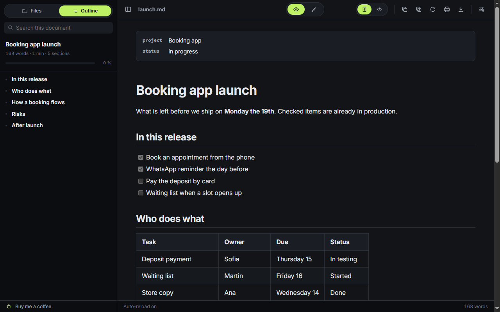
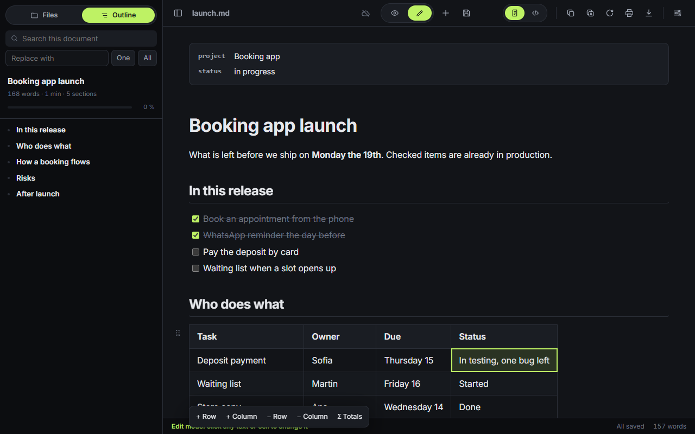

# SharpMD

[English](README.md) · Español

Notas en Markdown que tu IA escribe y tu equipo lee. Un editor de Markdown en la nube con la conexión MCP ya andando, que se edita sobre la página ya formateada, sin escribir sintaxis.

- **Sin escribir sintaxis.** Hacés clic en un título, una tabla, una lista de tareas, un diagrama o una fórmula y lo cambiás ahí mismo, con botones. El código está a un clic.
- **Nada que instalar.** Abre en el navegador, y las mismas notas están en cada dispositivo donde entrás. También hay extensión de Chrome y app en el celular.
- **Tu IA sobre las mismas notas.** Por MCP, Claude, Codex u otro cliente lee las notas del proyecto antes de una tarea, documenta lo que cambió y resuelve los comentarios que le dejás. O prendés el asistente dentro de la nota con tu propia clave.
- **Compartido con un enlace.** Una nota o una carpeta con otra cuenta, un enlace público, o una sesión en vivo donde todos escriben a la vez.
- **Conectado a tus herramientas.** API, webhooks firmados y direcciones de entrada para Make, n8n, Activepieces, Zapier y Slack.
- **Tus archivos siguen siendo tuyos.** Un `.md` de tu disco abre sin subirse. Carpetas con contraseña que el servidor no puede leer, código abierto y servidor propio si querés.





**Probala sin instalar nada: [sharpmd.app](https://sharpmd.app/)**

Gratis y de código abierto. Sin seguimiento: los archivos se leen en tu navegador y no se suben.

## Qué hace

- **Edición en el lugar**: pasás a modo Edición y hacés clic en cualquier párrafo, título, ítem o celda para cambiarlo. Negrita, cursiva, tachado, código y enlaces desde una barrita o con los atajos de siempre; agregar y quitar filas y columnas; tildar tareas. El Markdown se reescribe por detrás, sin que veas la sintaxis. Se guarda con Ctrl+S, o con guardado automático.
- **Escribir contenido nuevo**: Enter cierra un bloque y abre el siguiente, o agrega un ítem a la lista. Una línea que empieza con `#`, `-`, `1.`, `>` o `[]` se convierte en título, lista, cita o tarea mientras escribís. El clic derecho (o el botón +, o `/` en una línea vacía) inserta párrafo, título, lista, tabla, bloque de código, diagrama, fórmula, aviso, imagen o separador, y convierte, mueve, duplica o elimina el bloque donde hiciste clic. Ctrl+Z deshace las operaciones de bloques y Ctrl+Y las rehace. Shift + clic derecho deja el menú del navegador, para la ortografía.
- **Tableros**: un bloque `kanban` convierte los títulos en columnas y las tareas en tarjetas. Arrastrás tarjetas entre columnas, las tildás, agregás y renombrás. En cualquier otro programa se lee como una lista de tareas común.
- **Tarjetas con atributos**: cada tarjeta tiene un id estable, fecha de creación y de edición, y atributos propios (vencimiento, responsable, prioridad…). Un clic abre su detalle, y un tablero ancho usa todo el ancho de la nota.
- **Secciones desplegables y plegado**: una sección desplegable (`::: details Título`) se inserta desde el menú del bloque o con `/`, se le cambia el título tocándolo, envuelve los bloques elegidos y se desenvuelve. Plegar secciones por título es una opción de lectura en Ajustes: cada título pliega lo que tiene debajo, y nada se escribe en la nota.
- **Varios bloques a la vez**: se marcan arrastrando desde el margen izquierdo, con Mayúsculas o Ctrl + clic, o con Esc en un bloque y Mayúsculas + flechas; con el dedo, manteniendo apretado. Se copian, se cortan, se duplican, se eliminan, se mueven, se envuelven, pasan a ser una lista o una cita, o van a una nota nueva que deja un enlace en su lugar. Cada acción es un solo paso de deshacer.
- **Ajustes de la página**: lo que vale para una nota y no para la persona vive en su encabezado y viaja con el archivo: ancho de la página (normal, ancha, completa) y títulos numerados.
- **Automatizaciones**: webhooks firmados cuando cambia una nota o una tarjeta (listos para Slack y Discord, JSON para Make, n8n, Activepieces y Zapier), direcciones de entrada secretas que agregan texto a una nota o crean una tarjeta, y una API REST con los mismos tokens que el MCP. Está todo en [la página de la API](https://sharpmd.app/api.html).
- **Listas de tareas** que se tildan también leyendo; las hechas quedan tachadas.
- **Totales en tablas**: el botón Σ agrega una fila que suma cada columna con números. Una celda con `=sum`, `=avg`, `=min`, `=max`, `=count` o `=median` muestra el resultado de su columna, con la misma moneda y el mismo formato de decimales que los números de arriba.
- **Notas en la nube**, opcionales: entrás con un código que llega a tu correo, mandás una nota a la nube y la abrís en cualquier dispositivo, también sin conexión. Se comparten con otra cuenta o con un enlace público de solo lectura. Lo que eliminás de la nube queda 30 días en la papelera, y la cuenta se elimina desde Ajustes.
- **Carpetas con contraseña**: una carpeta de la nube puede llevar contraseña. Sus notas se cifran en el navegador y el servidor no puede leerlas. La desbloqueás para tu IA por el tiempo que elijas. En un plan de equipo, quien administra puede proteger igual el espacio entero, con una sola contraseña para el equipo.
- **Publicar un sitio**: una carpeta de la nube se convierte en un sitio web público, con menú, buscador y tema. Un sitio en el plan pago. Las páginas se dibujan en tu navegador y salen por un host aparte, sin scripts ni estilos de las notas. Una nota con `publish: false` queda afuera, y una carpeta con contraseña no se publica nunca. Se ofrece cuando el servidor tiene un host para sitios (`PAGES_URL`).
- **Sesiones en vivo**: abrís una sesión sobre una nota de la nube y mandás el enlace. Quien lo tiene entra desde el navegador con un nombre, sin cuenta, y editan todos a la vez. En una nota del equipo, los miembros que la tienen abierta editan sin el enlace.
- **Quién está**: en una nota de la nube, unos avatares chicos muestran quién la tiene abierta ahora, personas y agentes de IA que la trabajan con un token, y quién la editó por última vez.
- **IA por MCP**: Claude o cualquier cliente MCP puede listar, leer, escribir, agregar, mover y buscar en tus notas de la nube, leer su historial y llevar tableros kanban: crear uno, sumar tarjetas y moverlas por su id. Cada escritura devuelve un enlace que abre la nota en la app. Un token puede quedar limitado a una carpeta, y solo un token creado con el permiso de compartir puede compartir notas o crear enlaces públicos. Un comentario sobre un bloque le dice a la IA qué cambiar, y en Ajustes hay un mensaje listo para pegar en tu IA: con él, el agente documenta el proyecto en una carpeta (README, arquitectura, funciones, épicas, decisiones, bitácora) y lleva un tablero de tareas que seguís desde ahí (To do, In progress, Paused, Done). La plantilla "Espacio de proyecto" arma la misma estructura sin una IA.
- **Plantillas y enlaces**: 26 plantillas para arrancar una nota, y Ctrl+K para enlazar a una sección o a otro archivo eligiendo de una lista.
- **Editor de fórmulas** con vista previa en vivo, y editor de diagramas con piezas, paletas de colores y errores explicados.
- **En el celular**: la misma app en pantalla chica, y la app web abre sin conexión.
- **Emojis**: escribís `:` y elegís de la lista.
- **Notas en el navegador**: Nuevo arranca una nota que se guarda sola en el navegador, sin carpeta ni cuenta, y sigue ahí cuando volvés. Ctrl+S la convierte en archivo.
- **Editor de diagramas**: en modo Editar, un clic sobre un diagrama Mermaid o Graphviz lo abre con el código a un lado y la vista previa en vivo al otro. Nueve plantillas de Mermaid para arrancar (flujo, secuencia, estados, clases, datos, Gantt, torta, mapa mental, línea de tiempo); un error de sintaxis se muestra debajo del último dibujo que salió bien. Al pasar el mouse por un diagrama: copiar el código, bajar el SVG y ampliarlo.
- **Buscar y reemplazar** en el documento mientras editás, de a una coincidencia o todas.
- **Modo foco y máquina de escribir** (Ajustes → Edición): atenúa todo menos el bloque que estás escribiendo, y mantiene el renglón actual a media altura.
- **Exportar a HTML**: un solo archivo, con la matemática en MathML.
- **Leer en voz alta** (Ajustes → Herramientas): lee la nota entera, desde un bloque o lo elegido, con las voces de tu dispositivo. Marca el bloque que va leyendo y anuncia el código y los diagramas en vez de leerlos. Atajo: Alt+Shift+S.
- **Comunidad** (Ajustes → Herramientas): plantillas, temas y paletas de diagramas que comparte la gente, cada una revisada antes de publicarse. Lo que agregás funciona sin conexión, y podés compartir la nota abierta como plantilla, tu tema o una paleta. Solo contenido, nunca código.
- **Dictado** (Ajustes → Herramientas): escribís hablando, en español o en inglés, con órdenes para puntuar, poner títulos, listas, tareas y formato. "Fórmula … fin fórmula" arma LaTeX y "diagrama de flujo … fin diagrama" arma un diagrama de Mermaid, los dos a la vista mientras hablás. Usa el reconocimiento de voz del navegador, en el dispositivo cuando el navegador lo ofrece. Atajo: Alt+Shift+D.
- **Modo presentación** (Ajustes → Herramientas): la nota abierta como diapositivas a pantalla completa, una por cada título de nivel 1 o 2; un separador (`---`) corta a mano. Flechas, espacio, Inicio y Fin para moverte, O para la vista general, F para pantalla completa y L para el puntero láser. Una cita `> [!NOTE]` es una nota del orador y no se proyecta. Las diapositivas se exportan a PDF, una por página apaisada. Atajo: Alt+Shift+P.
- **Nota diaria** (Ajustes → Herramientas): un botón en el inicio y en el explorador abre la nota de hoy y, si no existe, la crea desde una plantilla, en el navegador, la nube o una carpeta del disco. Un calendario del mes marca los días que tienen nota, y cada nota diaria enlaza al día anterior y al siguiente. Funciona sin conexión. Atajo: Alt+Shift+H.
- **Exportar a Word** (Ajustes → Herramientas): suma Word (.docx) al menú Exportar. El archivo se arma en el navegador: títulos con estilos que alimentan el índice automático, listas, tareas con casilla, tablas, código, notas al pie, imágenes incrustadas y diagramas como imagen. Las fórmulas van como texto LaTeX.
- **Mapa de enlaces** (Ajustes → Herramientas): un gráfico de qué notas enlazan con cuáles, por enlaces relativos y `[[wikilinks]]`: se arrastra, se acerca, se filtra por carpeta, se busca, y un clic abre la nota. Bajo la nota abierta, las notas que enlazan a ella. Lee solo lo que ya está en el dispositivo y no envía nada. Atajo: Alt+Shift+G.
- **JSON y YAML** (Ajustes → Herramientas): un bloque `json`, `jsonc`, `yaml` o `yml`, o un archivo `.json`, `.yaml` o `.yml`, se ve como un árbol plegable: se pliega, se copia un valor o su ruta, y se editan valores, claves y tipos en el lugar. Solo se reescribe ese bloque. El YAML que no se puede reescribir igual (anclas, etiquetas, varios documentos) queda en solo lectura.
- **Importar a Markdown** (Ajustes → Herramientas): convierte un archivo de Word, Excel, PowerPoint, EPUB, PDF, HTML, CSV o TSV en una nota, en el navegador: no se sube nada. Se abre como nota nueva sin guardar o va al final de la nota abierta. Un diálogo muestra el avance y se puede cancelar. Del PDF sale solo el texto, sin OCR.
- **Asistente de IA (con tu clave)** (Ajustes → Herramientas, apagado por defecto): conectás tu propia clave de Claude (Anthropic), OpenAI o cualquier servidor compatible con OpenAI (OpenRouter, o Ollama y LM Studio en tu máquina). Sobre lo elegido o un bloque: mejorar la redacción, corregir ortografía y gramática, acortar, expandir, cambiar el tono, traducir, explicar o pedir otra cosa. El resultado llega como propuesta junto al original, con las diferencias marcadas, y elegís: reemplazar, insertar debajo, copiar o descartar. "Escribir con IA" genera Markdown en ese punto, con atajos para una tabla, una lista de tareas, un diagrama Mermaid (se valida con el parser y se reintenta una vez si falla), una fórmula LaTeX, un resumen, los puntos clave y las tareas de la nota. Un panel lateral responde preguntas sobre la nota abierta, y un comentario para la IA suma "Resolver con mi IA". Las llamadas salen de tu navegador derecho a tu proveedor: SharpMD nunca ve la clave ni el texto. La clave queda solo en ese dispositivo, cifrada con una llave que el navegador no deja exportar. Atajos: Alt+Shift+A y Alt+Shift+Q.
- **Archivos desde el árbol** (página de SharpMD): archivo nuevo, renombrar y eliminar con clic derecho. Los archivos y las carpetas enteras se mueven arrastrándolos, y un archivo soltado adentro de la nota que estás editando queda como enlace (o como imagen) en ese punto.
- **Imágenes**: se pegan del portapapeles, se arrastran a la nota o se eligen de un archivo (en el teléfono, de la galería o de la cámara). Cada una se achica en el navegador y pierde sus metadatos, ubicación incluida (Ajustes → Lectura y edición → Calidad de las imágenes: Normal, Alta u Original). En una carpeta del disco se guarda en `assets/`, al lado del documento. En una nota de la nube se sube como adjunto y la nota guarda su dirección: subir es del plan pago (una cuenta gratis inserta imágenes por dirección), 10 MB por imagen y 1 GB, 2 GB por persona en una bolsa común del equipo, con la lista en Ajustes → Nube → Almacenamiento. En una carpeta protegida se cifra en el navegador, y proteger una carpeta cifra las imágenes que sus notas ya tenían.
- **No solo Markdown** (página de SharpMD): los archivos de código y configuración se ven resaltados y se editan como texto, los CSV y TSV se ven como tabla, y las imágenes como imágenes.
- **Índice automático** del documento, con la sección actual resaltada mientras se hace scroll.
- **Árbol de carpetas**: los archivos Markdown de la carpeta del documento, con subcarpetas que se abren y botón para subir de nivel.
- **Recarga automática** cuando el archivo cambia en disco, sin perder la posición.
- **Doce temas incluidos**, seis claros y seis oscuros, en una grilla de miniaturas con vista previa en vivo. Los doce son gratis. Cada uno fija la página, los paneles, el texto, los bordes, los enlaces, la selección, la sintaxis del código y los diagramas, con contraste AA medido (`tests/themes.mjs`).
- **Tema** claro, oscuro o automático. Los colores de acento, la tipografía y el CSS propio son extras de agradecimiento para quienes apoyan el proyecto, y se liberan a palabra: no hay verificación. Todo lo que hace el lector y el editor es gratis.
- **Contenido centrado**, con **ancho**, **tamaño de letra**, **interlineado** y **tipografía** a medida. Las líneas largas del código bajan de renglón, con un ajuste para dejarlas con scroll.
- **CSS propio** encima del tema.
- **Plugins de Markdown**, cada uno con su interruptor: resaltado de código, emoji, subíndice y superíndice, insertado, marcado, abreviaturas, listas de definición, notas al pie, listas de tareas, alertas estilo GitHub, índice en el texto (`[[toc]]`), matemática con KaTeX, diagramas con Mermaid y Graphviz, tablas con celdas combinadas, bloques `::: tip` y la cabecera YAML mostrada como ficha.
- **Español e inglés**: toma el idioma del navegador (español, o inglés para cualquier otro) y se cambia desde Ajustes.
- **Búsqueda siempre a la vista, con dos alcances**: con la pestaña Índice busca en el documento abierto; con la pestaña Carpeta busca el texto en todos los Markdown de la carpeta y sus subcarpetas.
- **Links `[[nombre]]`** que abren el archivo de la carpeta con ese nombre.
- **Posición de lectura** recordada por archivo.
- **Contador** de palabras del documento y de palabras y caracteres de lo seleccionado.
- Barra de íconos arriba: cambiar entre documento y código fuente, copiar el Markdown, copiar con formato, recargar, imprimir o guardar PDF, y ajustes.
- Botón de copiar en los bloques de código y visor de imágenes.

## Instalación

1. Abrir `chrome://extensions`.
2. Activar **Modo de desarrollador** (arriba a la derecha).
3. **Cargar descomprimida** y elegir esta carpeta .
4. En la tarjeta de SharpMD, entrar a **Detalles** y activar **Permitir acceso a URL de archivo**. Sin eso no abre archivos locales.
5. Si hay otra extensión de Markdown instalada, desactivarla para que no actúen las dos sobre el mismo archivo.

Después alcanza con arrastrar un `.md` al navegador.

## Abrir archivos desde SharpMD

Hacé clic en el ícono de la extensión: abre SharpMD, donde empezás una nota nueva o elegís un archivo o una carpeta (o los arrastrás) y los leés y editás ahí mismo. Abre la app web, o la página de la extensión cuando no hay conexión; en Ajustes → Instalar se elige cuál. Como la carpeta ya la elegiste vos, guardar no pide ningún permiso más, y la página recuerda lo último que abriste.

Con la extensión instalada, la app web y la extensión comparten un solo depósito: las mismas notas del navegador y la misma lista de archivos y carpetas abiertos de los dos lados. Una carpeta abierta de un lado figura del otro como "Reconectar": se elige una vez ahí y queda. La sesión de la nube no se comparte: cada lado entra por su cuenta.

**Un enlace que abre un archivo local.** `https://sharpmd.app/src/app.html#open=` seguido de la dirección `file://` codificada abre ese `.md` de tu disco con la extensión, después de que confirmás. La ruta queda en el fragmento, así que no sale del navegador. Se copia desde el menú Copiar o con clic derecho sobre un archivo del explorador.

Abrir un `.md` directo en el navegador sigue funcionando igual que antes. La pestaña Carpeta de la barra lateral tiene un botón que lleva a esta página.

## Sin instalar nada

La página de SharpMD es HTML y JavaScript, así que también funciona servida desde cualquier hosting estático, sin la extensión. En Chrome, Edge, Brave y otros navegadores Chromium abre archivos y carpetas y guarda en el lugar. En Firefox y Safari, que no dejan que una página escriba en el disco, abre de a un archivo y al guardar descarga una copia. En los dos casos no se sube nada: los archivos se leen en tu navegador.

Está publicada en [sharpmd.app](https://sharpmd.app/). Desde Ajustes → Instalar se instala como app, con ventana propia, y Windows la ofrece en "Abrir con" para los `.md`. Ahí mismo están los pasos para iPhone y iPad (en Safari: Compartir, Agregar a inicio) y para Mac (en Safari: Archivo, Agregar al Dock; en Chrome o Edge: el ícono de instalar). En iPhone respeta la muesca y la barra de inicio, deja la barra de formato arriba del teclado y exporta por la hoja de compartir. Safari puede borrar las notas del navegador tras semanas sin uso si la app no está instalada: conviene instalarla o usar la nube. Para correr tu propia copia, serví esta carpeta (`npx serve .`) y abrí la dirección que te muestra.

La app de Android es esta misma web empaquetada (Trusted Web Activity): abre `sharpmd.app` a pantalla completa, con las mismas notas y la misma cuenta. Otras apps le pueden mandar cosas con "Compartir": un archivo Markdown, de texto, JSON o YAML se abre como documento sin guardar, y un texto o un enlace arranca una nota nueva; anda sin conexión. También figura en "Abrir con" para esos archivos. `.well-known/assetlinks.json` lleva la huella de la llave que firma la app.

## Actualizar

Chrome no puede actualizar una extensión cargada desde una carpeta, así que SharpMD mira este repositorio una vez por día (o por semana, o nunca: Ajustes → Actualizaciones) y avisa en la barra lateral cuando hay una versión más nueva. Desde ahí: descargás el ZIP, reemplazás la carpeta de la extensión con su contenido y tocás **Aplicar**, que recarga la extensión. Si clonaste el repositorio, alcanza con `git pull` y **Aplicar**.

Lee el número de versión publicado y no manda ningún dato. El otro pedido de red que hace la extensión es una consulta corta, al tocar su botón, para saber si la app web contesta.

## Atajos

En una Mac, Ctrl es ⌘ y Alt es ⌥ (rehacer es ⇧⌘Z), y la app los muestra así.

| Atajo | Acción |
|---|---|
| Alt+Shift+B | Mostrar u ocultar la barra lateral |
| Alt+Shift+C | Centrar o no el contenido |
| Alt+Shift+R | Activar o desactivar la recarga automática |
| Alt+Shift+T | Cambiar el tema |
| Alt+Shift+S | Leer en voz alta: empezar, pausar y seguir (con la herramienta prendida) |
| Alt+Shift+D | Dictado: empezar y cortar (con la herramienta prendida) |
| Alt+Shift+P | Modo presentación: empezar y salir (con la herramienta prendida) |
| Alt+Shift+H | Nota diaria: abrir la nota de hoy (con la herramienta prendida) |
| Alt+Shift+G | Mapa de enlaces: abrir y cerrar (con la herramienta prendida) |
| Alt+Shift+A | Asistente de IA: acciones sobre lo elegido o el bloque (con la herramienta prendida) |
| Alt+Shift+Q | Asistente de IA: abrir y cerrar el panel para preguntar sobre la nota (con la herramienta prendida) |
| Ctrl+Shift+F | Buscar en el documento |

Se cambian en `chrome://extensions/shortcuts`.

## Estructura

```
manifest.json
_locales/         nombre, descripción y atajos de la extensión (en, es)
src/
  defaults.js     ajustes por defecto, acceso al storage y el diccionario español/inglés
  kit.js          íconos y utilidades compartidas
  markdown.js     el parser con sus plugins: links [[wiki]], matemática, cabecera YAML
  theme.js        los doce temas incluidos, modo claro u oscuro y color de acento
  serialize.js    del bloque editado al Markdown
  store.js        permisos de archivos y carpetas, guardados en IndexedDB
  bridge.js       un solo depósito entre la app web y la extensión: iguala los dos lados y reconecta carpetas
  bridge-cs.js    script de contenido en la app web, que le pasa sus pedidos a la extensión
  bridge-sw.js    el lado de la extensión del puente, y qué abre el botón de la extensión
  install.js      Ajustes → Instalar, instalar la app, los archivos de "Abrir con", la marca de sin conexión
  tools.js        Ajustes → Herramientas: el registro de herramientas y sus interruptores
  community.js    lo agregado de la galería de la comunidad y la regla que valida un aporte
  gallery.js      Ajustes → Herramientas → Comunidad: ver, probar, agregar y compartir
  speak.js        herramienta: leer en voz alta con las voces del dispositivo
  voice.js        la gramática del dictado: órdenes de texto, fórmulas y diagramas, por idioma
  dictate.js      herramienta: dictado, el botón del micrófono y el indicador de escucha
  present.js      herramienta: modo presentación, las diapositivas de la nota abierta
  daily.js        herramienta: nota diaria, su calendario y los enlaces al día anterior y al siguiente
  docx.js         herramienta: exportar a Word, las partes de OOXML y un zip mínimo
  linkmap.js      herramienta: mapa de enlaces en un canvas y los enlaces a la nota abierta
  jsonyaml.js     herramienta: bloques y archivos JSON y YAML como un árbol que se edita, con su lector y escritor de YAML
  import.js       herramienta: Word, Excel, PowerPoint, EPUB, PDF, HTML y CSV a Markdown, con su lector de zip y sus topes
  aikey.js        asistente de IA: los proveedores, la clave guardada y las llamadas en streaming (sin interfaz)
  assistant.js    herramienta: asistente de IA con tu clave (acciones, escribir con IA, el panel, sus opciones)
  home.js         pantalla de inicio de la página propia
  write.js        bloques nuevos, atajos de Markdown y menú de clic derecho
  diagram.js      editor de diagramas con vista previa en vivo
  board.js        tableros kanban y cuentas en tablas
  extras.js       archivos desde el árbol, imágenes pegadas, reemplazar, máquina de escribir, exportar a HTML
  images.js       achicar imágenes en el navegador, adjuntos de la nube, almacenamiento en Ajustes
  content.js      el lector: interfaz, índice, árbol, búsqueda, edición, guardado, ajustes
  content.css     estilos y temas
  background.js   lectura de archivos y carpetas, carga diferida de las librerías pesadas, atajos, aviso de versión
  web.js          reemplaza las APIs de la extensión cuando la página se sirve desde un sitio
  storeapp.js     avisa si la página corre dentro de la app de Android
  app.html        la página de SharpMD: abrir un archivo o una carpeta y editar ahí
vendor/           librerías de terceros, sin modificar
examples/         documentos de prueba con todas las funciones
tests/            prueba de punta a punta
```

No hay paso de build: se edita y se recarga la extensión.

## Pruebas

```
cd tests
npm install
npm test
```

Carga la extensión en un Chromium y recorre los dos modos: el `.md` abierto directo en el navegador y la página propia con una carpeta. Necesita un Chromium de Playwright (`npx playwright install chromium`) o la variable `CHROME_BIN` apuntando a otro.

Otros dos scripts se corren a mano, fuera de `npm test`:

- `node themes.mjs` mide el contraste de los doce temas incluidos, sin navegador.
- `BROWSER=firefox node browsers.mjs` (o `webkit`) recorre la portada y la app web en los otros motores. En WebKit recorre además la app como la ve un iPhone, un iPad y una Mac (capturas con prefijo `iphone-` e `ipad-`); ese motor no es Safari, así que falta mirarlo en un dispositivo real. Se instalan una vez con `npx playwright-core install firefox webkit`.
- `node perf.mjs` mide la carga de la app web, en frío y en caliente, con la red y la CPU limitadas. Conviene correrlo antes y después de tocar lo que carga `src/app.html`.

Un script que el primer pintado no necesita no se suma a `src/app.html`: va en `LAZY_APP` (`src/content.js`) y en la lista `LATE` de `sw.js`, y sigue en `manifest.json` para la extensión.

## Librerías de terceros

Todas van copiadas en `vendor/`, porque Manifest V3 no permite cargar código remoto.

| Librería | Licencia |
|---|---|
| markdown-it y sus plugins (emoji, sub, sup, ins, mark, abbr, deflist, footnote, multimd-table, container) | MIT |
| highlight.js | BSD-3-Clause |
| KaTeX | MIT |
| Mermaid | MIT |
| Viz.js (Graphviz) | MIT |
| DOMPurify | MPL-2.0 o Apache-2.0 |
| PDF.js (se carga solo para convertir un PDF) | Apache-2.0 |
| Inter (tipografía) | OFL-1.1 |

El HTML que sale del Markdown pasa por DOMPurify antes de entrar a la página.

## Tarjetas del tablero

Un tablero es un bloque de código `kanban`. Cada título es una columna (el estado de sus tarjetas) y cada tarea una tarjeta. Una tarjeta puede terminar con un grupo entre llaves con sus atributos:

````
```kanban
{show=vence,responsable prioridad=baja|media|alta puntos=number}
## Por hacer
- [ ] Arreglar el pago {vence=2026-10-20 responsable="Ana Paz" id=c8k2m9xq created=2026-10-07T14:03:11Z updated=2026-10-07T15:10:02Z}
- [ ] Una tarjeta sin nada más

## Hecho
```
````

- `id`, `created` y `updated` los escribe SharpMD. El id no cambia nunca; `updated` cambia al mover o editar la tarjeta. Las fechas van en ISO 8601, en UTC.
- El resto es tuyo: `clave=valor`, con comillas si el valor tiene espacios. Las claves empiezan con una letra y no llevan espacios.
- Un renglón solo con llaves antes de la primera columna configura el tablero: `show` dice qué atributos se ven en las tarjetas, y `clave=text`, `clave=date`, `clave=number` o `clave=a|b|c` (una lista de opciones) le da un tipo a un atributo.
- Un tablero sin nada de esto se abre igual. Sus tarjetas reciben id y fecha de creación la primera vez que se edita. Unas llaves que no son `clave=valor` quedan como texto.

## Ajustes de la página

Se guardan en el encabezado de la nota, con claves simples:

```
---
width: wide
numbered: true
toc: false
---
```

`width` es `normal`, `wide` o `full`; `numbered` numera los títulos; `toc: false` oculta el índice de esa nota en el panel lateral y la lista "En esta página" de su página en un sitio publicado. La lista de claves es cerrada y cada valor se comprueba: una clave o un valor que no se conoce no hace nada, y una nota nunca puede traer CSS. Valen para quien abra la nota, también por un enlace público o en una sesión en vivo. En la app: el botón de página de la barra de arriba, o "Ajustes de la página" en el menú "más" del teléfono.

## Notas en la nube y servidor de sincronización

En `server/` está SharpMD Sync: cuentas, notas en la nube y un servidor MCP para que una IA las lea y las escriba. Entrás desde la pantalla de inicio con un código que llega a tu correo. El plan gratis guarda 10 notas en la nube e incluye la conexión MCP sobre esas notas; el pago (USD 40 por año o USD 4 por mes) no tiene límite y suma subir imágenes, compartir, las automatizaciones, 30 días de historial y las opciones de apariencia. El plan de equipo (USD 5 por persona por mes, desde 2 personas, gratis por 14 días) le da a cada miembro el plan pago y un espacio compartido para las notas del equipo: quien paga invita por correo y administra los lugares. Cada miembro es administrador, editor o lector. Quienes administran deciden los ajustes del equipo (si los miembros comparten notas del equipo hacia afuera, crean enlaces públicos, conectan su IA o usan automatizaciones en el espacio, cuánto dura su historial, y la carpeta y la plantilla de las notas nuevas), crean tokens del equipo, que son del equipo y no de una persona, y leen un registro de actividad con quién hizo qué, sin el contenido de las notas. El espacio del equipo guarda un año de historial de versiones. Los ajustes personales son de cada persona, y solo quien paga ve precios y cobro. Esa persona puede proteger el espacio del equipo con una sola contraseña: las notas del equipo se cifran en el navegador de cada miembro y el servidor no las puede leer. Los miembros reciben la contraseña de quien administra, por fuera de la app.

El servidor es un solo archivo, sin dependencias, y lo podés alojar vos: cargás su dirección en Ajustes → Cuenta, o escribís `off` ahí para usar SharpMD sin nada de nube. El detalle está en [server/README.md](server/README.md).

La app es MIT. El servidor de `server/` es AGPL-3.0 o posterior.

## Apoyar

[](https://ko-fi.com/surlabs)

El editor es gratis y no tiene analítica. Si te ahorra tiempo, podés [bancar la próxima herramienta en Ko-fi](https://ko-fi.com/surlabs).
