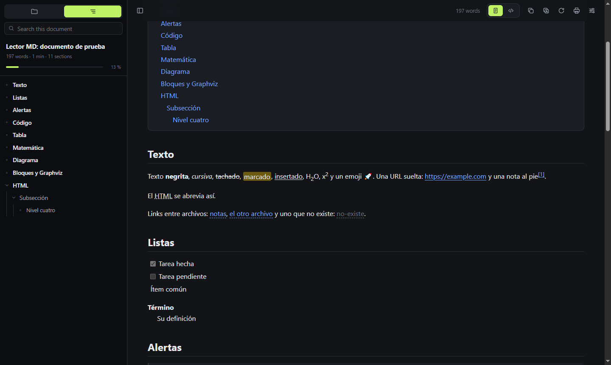
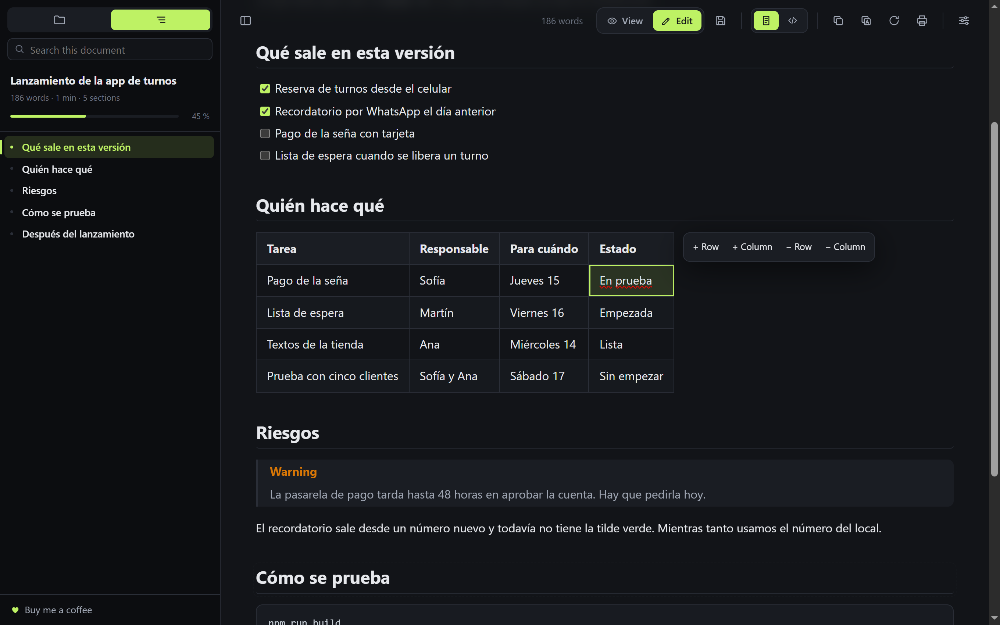
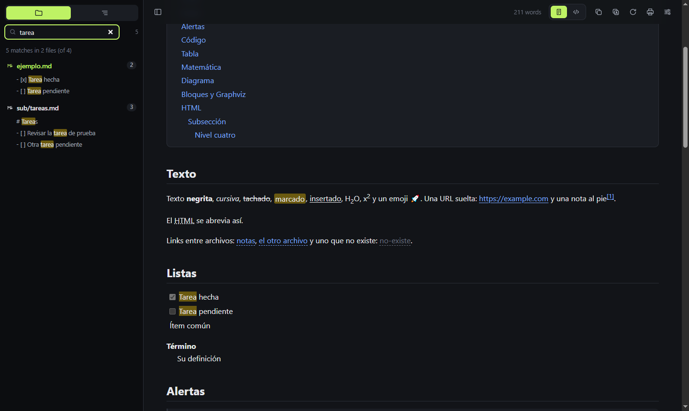
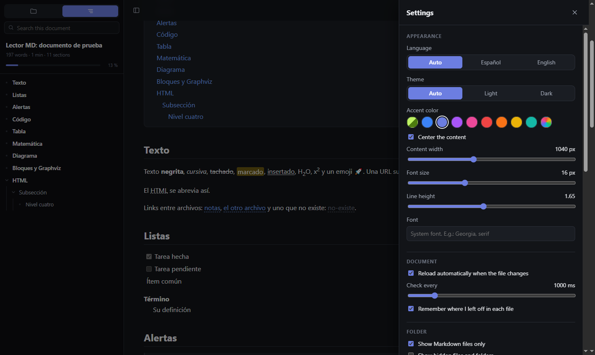

# MD Tools

English · [Español](README.es.md)

**Try it without installing: [mr-axel.github.io/md-tools](https://mr-axel.github.io/md-tools/)**

A Chrome extension to read and edit Markdown files in the browser, local (`file://`) or served over the web. No accounts, no paid plan, no data sent anywhere: everything runs on your machine.





## What it does

- **Edit in place**: switch to Edit mode and click any paragraph, heading, list item or table cell to change it. Bold, italic, strikethrough, code and links from a small toolbar or the usual shortcuts; add and remove table rows and columns; tick task boxes. The Markdown is rewritten behind the scenes, so you never see the syntax. Save with Ctrl+S, or turn on auto-save.
- **Write new content**: Enter closes a block and opens the next one, or adds a list item. A line that starts with `#`, `-`, `1.`, `>` or `[]` turns into a heading, a list, a quote or a task as you type. Right-click (or the + button, or `/` on an empty line) inserts a paragraph, heading, list, table, code block, diagram, formula, callout, image or divider, and turns, moves, duplicates or deletes the block you clicked. Ctrl+Z undoes block operations and Ctrl+Y redoes them. Shift+right-click keeps the browser menu, for spelling.
- **Boards**: a `kanban` block turns headings into columns and tasks into cards. Drag cards between columns, tick them, add and rename. In any other program it reads as a plain task list.
- **Task lists** you can tick while reading; done items are struck through.
- **Table totals**: the Σ button adds a row that sums each numeric column. A cell with `=sum`, `=avg`, `=min`, `=max`, `=count` or `=median` shows the result for its column, keeping the currency and decimal style of the numbers above.
- **Notes in the browser**: New starts a note that saves itself in the browser, with no folder or account, and is still there when you come back. Ctrl+S turns it into a file.
- **Diagram editor**: in Edit mode, click a Mermaid or Graphviz diagram to open it side by side with a live preview. Nine Mermaid templates to start from (flowchart, sequence, states, classes, data, Gantt, pie, mind map, timeline); a syntax error shows under the last drawing that worked. Hovering a diagram offers copy code, download SVG and enlarge.
- **Find and replace** in the document while editing, one match or all.
- **Focus mode and typewriter mode** (Settings → Editing): dim everything but the block you are writing, and keep the current line at mid height.
- **Export to HTML**: one standalone file, with math as MathML.
- **Files from the tree** (MD Tools page): new file, rename and delete with a right-click.
- **Paste images** (MD Tools page): an image from the clipboard is saved to `assets/` next to the document and inserted.
- **More than Markdown** (MD Tools page): code and config files open highlighted and are edited as text, CSV and TSV open as a table, and images open as images.
- **Outline** built from the document headings: collapsible tree, current section highlighted, reading progress.
- **Folder tree**: the Markdown files next to the open document, with subfolders and a button to go up a level.
- **Auto-reload** when the file changes on disk, keeping your scroll position.
- **Search with two scopes**: on the Outline tab it searches the open document; on the Folder tab it searches the text of every Markdown file in the folder and its subfolders.
- **Themes**: light, dark or automatic. Accent colors, the font and custom CSS are thank-you extras for people who support the project, unlocked on the honor system: there is no check. Everything the reader and editor do is free.
- **Layout to taste**: centered content, content width, font size, line height and font family. Long lines in code blocks wrap, with a switch to scroll them sideways.
- **Custom CSS** on top of the theme.
- **Markdown plugins**, each with its own switch: code highlighting, emoji, subscript and superscript, inserted and highlighted text, abbreviations, definition lists, footnotes, task lists, GitHub-style alerts, inline table of contents (`[[toc]]`), math with KaTeX, diagrams with Mermaid and Graphviz, tables with merged cells, `::: tip` blocks, and YAML front matter shown as a card.
- **`[[name]]` links** that open the file with that name in the folder.
- **Reading position** remembered per file.
- **Word counter** for the document, and words and characters for the current selection.
- Toolbar: switch between document and source, copy the Markdown, copy with formatting, reload, print or save as PDF, settings.
- **English and Spanish**: follows the browser language (Spanish, or English for anything else) and can be changed in Settings.

| Folder search | Settings |
|---|---|
|  |  |

## Install

It is not on the Chrome Web Store yet. To load it from source:

1. Download this repository (Code → Download ZIP) and unzip it, or clone it.
2. Open `chrome://extensions`.
3. Turn on **Developer mode** (top right).
4. Click **Load unpacked** and pick the folder.
5. On the MD Tools card, open **Details** and turn on **Allow access to file URLs**. Without it, local files will not open.
6. If you have another Markdown extension installed, disable it so they do not both act on the same file.

Then drag any `.md` file into the browser. `ejemplo/ejemplo.md` exercises every feature.

It also works in other Chromium browsers (Edge, Brave, Arc) through the same steps.

## Opening files from MD Tools itself

Click the extension icon and choose **New** or **Open**. **New** starts an empty note ready to type; the first Ctrl+S asks where to save it. **Open** takes you to the MD Tools page, where you pick a file or a folder (or drag one in) and read and edit it right there. Because you already chose the folder, saving needs no extra permission step, and the page remembers what you opened recently.

Opening a `.md` directly in the browser keeps working as before. The folder tab of the sidebar has a button that takes you to this page.

## Without installing anything

The MD Tools page is plain HTML and JavaScript, so it also runs served from any static host, with no extension. In Chrome, Edge, Brave and other Chromium browsers it opens files and folders and saves in place. In Firefox and Safari, which do not let a page write to disk, it opens one file at a time and saving downloads a copy. Either way nothing is uploaded: the files are read in your browser.

It is published at [mr-axel.github.io/md-tools](https://mr-axel.github.io/md-tools/). To run your own copy, serve this folder (`npx serve .`) and open the address it prints.

## Updating

Chrome cannot update an extension loaded from a folder, so MD Tools checks this repository once a day (or once a week, or never: Settings → Updates) and shows a notice in the sidebar, and in the popup of the extension icon, when there is a newer version. From there: download the ZIP, replace the extension folder with its contents and click **Apply**, which reloads the extension. If you cloned the repository, `git pull` and **Apply** is enough.

## Shortcuts

| Shortcut | Action |
|---|---|
| Alt+Shift+B | Show or hide the sidebar |
| Alt+Shift+C | Toggle centered content |
| Alt+Shift+R | Toggle auto-reload |
| Alt+Shift+T | Switch theme |
| Ctrl+Shift+F | Focus the search box |

Change them at `chrome://extensions/shortcuts`.

## Saving

Chrome does not let an extension write to disk on its own, so the first time you save, MD Tools asks for permission. Pick the folder the file lives in, or one that contains it: from then on every Markdown file inside saves straight to itself, and the choice is remembered across sessions. Chrome may still show a one-click confirmation the first time in each session. You can also grant a single file instead of a folder.

## Privacy

MD Tools collects nothing and sends nothing. The single network request it makes is a daily check of the version number published in this repository, so it can tell you when there is an update. You can make it weekly or turn it off in Settings. Settings and reading positions are stored locally in the browser. The broad permissions exist for one reason each: `file:///*` and `*://*/*` so it can render Markdown wherever the file lives, and `scripting` to load KaTeX, Mermaid and Graphviz only when a document uses them.

HTML produced from the Markdown goes through DOMPurify before it reaches the page.

## Project layout

```
manifest.json
_locales/         extension name, description and shortcut labels (en, es)
src/
  defaults.js     default settings, storage access and the Spanish/English dictionary
  kit.js          icons and shared helpers
  markdown.js     the parser and its plugins: [[wiki]] links, math, YAML front matter
  theme.js        light or dark theme and accent color
  serialize.js    from an edited block back to Markdown
  store.js        file and folder permissions, kept in IndexedDB
  home.js         start screen of the MD Tools page
  write.js        new blocks, Markdown shortcuts and the right-click menu
  diagram.js      diagram editor with live preview
  board.js        kanban boards and table formulas
  extras.js       files from the tree, pasted images, replace, typewriter mode, HTML export
  content.js      the reader: interface, outline, tree, search, editing, saving, settings
  content.css     styles and themes
  background.js   reads files and folders, lazy-loads the heavy libraries, shortcuts, update check
  web.js          stands in for the extension APIs when the page is served from a site
  app.html        the MD Tools page: open a file or a folder and edit it there
  popup.html/js   on/off switch and the button that opens the MD Tools page
vendor/           third-party libraries, unmodified
ejemplo/          sample documents covering every feature
tests/            end-to-end smoke test
```

There is no build step: edit and reload the extension.

## Tests

```
cd tests
npm install
npm test
```

It loads the extension in a Chromium and walks through both modes: a `.md` opened directly in the browser, and the MD Tools page with a folder. It needs a Playwright Chromium (`npx playwright install chromium`) or `CHROME_BIN` pointing at another one.

## Third-party libraries

All of them are vendored in `vendor/`, because Manifest V3 does not allow remote code.

| Library | License |
|---|---|
| markdown-it and plugins (emoji, sub, sup, ins, mark, abbr, deflist, footnote, multimd-table, container) | MIT |
| highlight.js | BSD-3-Clause |
| KaTeX | MIT |
| Mermaid | MIT |
| Viz.js (Graphviz) | MIT |
| DOMPurify | MPL-2.0 or Apache-2.0 |
| Inter (typeface) | OFL-1.1 |

## Support

[](https://ko-fi.com/surlabs)

MD Tools is free and collects no data. If it saves you time, you can [support the next tool on Ko-fi](https://ko-fi.com/surlabs).

## License

MIT. See [LICENSE](LICENSE).
