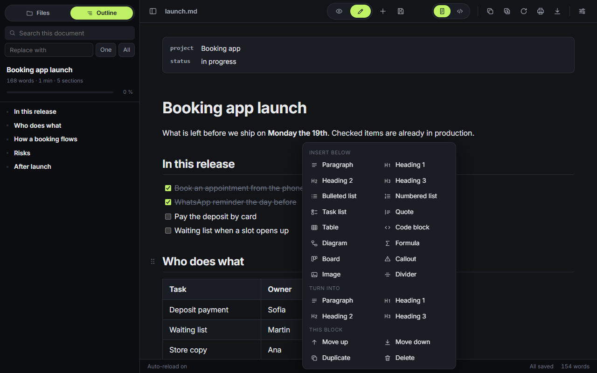
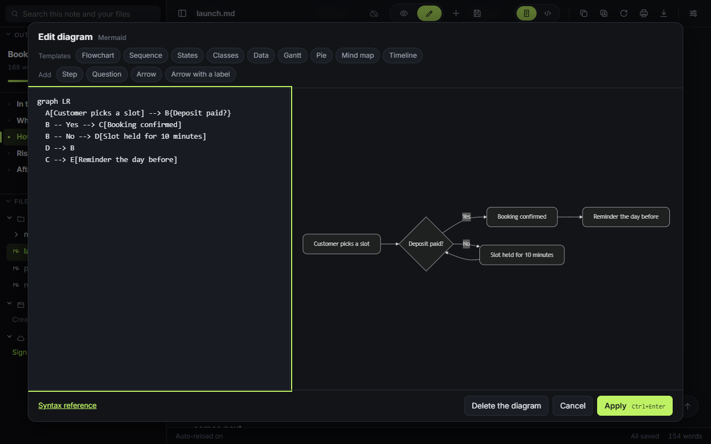
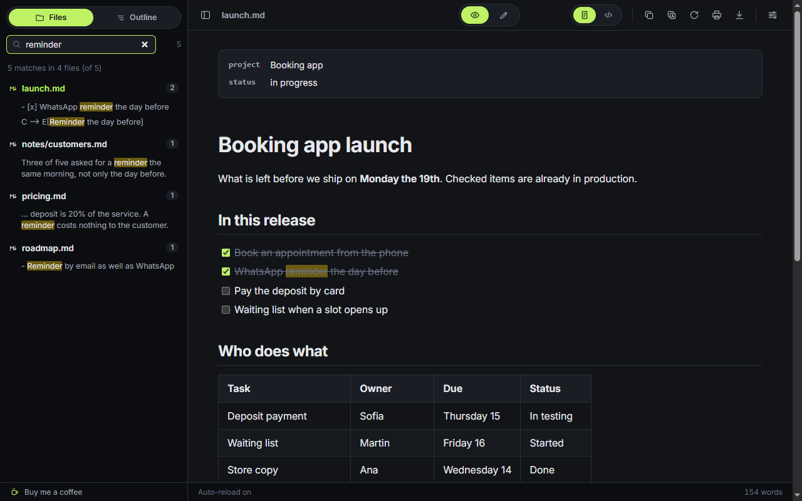

<p align="center"></p>

<h1 align="center">SharpMD</h1>

<p align="center">Markdown notes your AI writes and your team reads.<br>A Markdown editor in the cloud with the MCP endpoint already running. You edit on the formatted page, with no syntax to type.</p>

<p align="center">
  <a href="https://sharpmd.app/"><strong>Website</strong></a> ·
  <a href="https://sharpmd.app/src/app.html"><strong>Open the web app</strong></a> ·
  <a href="#install"><strong>Install the extension</strong></a> ·
  <a href="README.es.md">Español</a>
</p>

- **No syntax to type.** Click a heading, a table, a task list, a diagram or a formula and change it right there, with buttons. The source is one click away.
- **Nothing to install.** It opens in the browser, and the same notes are on every device you sign in on. There is also a Chrome extension and an app on the phone.
- **Your AI on the same notes.** Over MCP, Claude, Codex or another client reads the notes of the project before a task, documents what it changed and resolves the comments you leave. Or turn on the assistant inside the note with your own key.
- **Shared by link.** A note or a folder with another account, a public link, or a live session where everyone writes at once.
- **Wired to your tools.** An API, signed webhooks and inbound addresses for Make, n8n, Activepieces, Zapier and Slack.
- **Your files stay yours.** A `.md` on your disk opens without being uploaded. Folders with a password that the server cannot read, open source, and your own server if you want one.


Free and open source. No tracking: files are read in your browser and never uploaded.

## Features

| | |
|---|---|
| **Edit in place** | Click a paragraph, a heading, a list item or a table cell and type. The Markdown is rewritten behind it. |
| **Formatting as you type** | `**bold**`, `*italic*` and `` `code` `` turn into formatting. A line that starts with `#`, `-`, `1.`, `>` or `[]` becomes a heading, a list, a quote or a task. |
| **Blocks** | Right-click, the handle next to a block, the + button or `/` on an empty line: insert, turn into, move, duplicate or delete. Undo with Ctrl+Z, redo with Ctrl+Y. |
| **Tables** | Add and remove rows and columns. A totals row sums each column, and a cell can hold `=sum`, `=avg`, `=min`, `=max`, `=count` or `=median`. |
| **Boards** | A `kanban` block turns headings into columns and tasks into cards you can drag. Each card has a stable id, created and edited dates and your own attributes (due date, owner, priority…), and a click opens its detail. Anywhere else it reads as a plain task list. A wide board uses the full width of the note. |
| **Collapsible sections and folding** | A collapsible section (`::: details Title`) is inserted from the block menu or with `/`, renamed by clicking its title, wrapped around the selected blocks and unwrapped again. Headings fold too: a small chevron in the left margin of each heading folds what is under it, and nothing is written to the note. It is on by default and turns off in Settings. |
| **Several blocks at once** | Drag from the left margin, Shift or Ctrl + click, or press Esc in a block and extend with Shift + arrows; on touch, press and hold. Copy, cut, duplicate, delete, move, wrap, turn into a list or a quote, or send the blocks to a new note that leaves a link behind. Each action is one undo step. |
| **Page settings** | Settings that belong to a note, kept in its front matter so they travel with the file: page width (normal, wide, full), numbered headings and whether the outline shows. |
| **Diagrams** | Mermaid and Graphviz, with an editor that shows the drawing next to the code: templates, pieces to add with a button, color palettes, and errors explained with their line marked. |
| **Math** | KaTeX, inline and in blocks, with an editor that previews as you type. |
| **Images** | Insert by address or from a file, pick a size, paste from the clipboard or drop them into the note. Each image is made smaller in the browser and loses its metadata, location included (Settings → Reading and editing → Image quality: Normal, High or Original). In a folder on disk it is saved next to the document. In a cloud note it is uploaded as an attachment and the note keeps its address: uploading is part of the paid plan (a free account inserts images by address), 10 MB per image and 1 GB, 2 GB per member in a shared pool on a team, with the list in Settings → Cloud → Storage. In a protected folder it is encrypted in the browser, and protecting a folder encrypts the images its notes already had. |
| **Files** | The outline on top and the explorer below, with the folder on disk, the notes kept in the browser and the cloud. Search across all of them, create from a template, rename, delete, and move files and whole folders by dragging. Drag a file from the explorer into the note you are editing and it becomes a link (or an image) where you drop it. Picking a file never reloads the page, also over a `.md` opened straight from disk: the folders you opened, the search and the focus stay where they were, and the arrow keys walk the list. The explorer notices on its own what changes in the folder: a file created by another program shows up within seconds, marked for a moment, and deleted or renamed ones go away. A Refresh button forces it. A `.txt`, `.json` or `.yaml` in the folder opens inside SharpMD and saves in its own format. |
| **Links** | Ctrl+K links to a section of the note, to another file or to one of its sections, picked from a list. `[[name]]` works too. |
| **Outline** | Built from the headings, with the current section and reading progress. |
| **Notes** | New starts a note that saves itself in the browser, or in a folder you choose. 26 templates to start from. |
| **Emoji** | Type `:` and pick from the list. |
| **Focus** | Focus mode dims everything but the block you are writing; typewriter mode keeps the line at mid height. |
| **Export** | One standalone HTML file, or PDF through print. |
| **More than Markdown** | Code and config files open highlighted, CSV as a table, images as images. |
| **Cloud notes** | Optional. Sign in with a code sent to your email, move a note to the cloud and open it on any device, also without a connection. A deleted cloud note stays in the trash for 30 days. The account can be deleted from Settings. |
| **Protected folders** | A cloud folder can carry a password. Its notes are encrypted in the browser and the server cannot read them. You unlock it for your AI for as long as you choose. An account can protect its whole cloud with one password too, from Settings → Cloud: the app offers it the first time you save a note to the cloud. With the whole cloud protected there is no sharing, public links, published site or automations until you remove the protection. On a team plan the administrator can protect the whole team space the same way, with one password for the team. |
| **Sharing** | A note or a folder with another account, to read or to edit, or a read-only public link with a password. |
| **Publish a site** | A cloud folder becomes a public website with a menu, search and a theme: one site on the paid plan. Pages are drawn in your browser and served from a separate host, with no script and no style of the notes. A note with `publish: false` stays out, and a protected folder is never published. Offered when the server has a host for sites (`PAGES_URL`). |
| **Live sessions** | Open a session on a cloud note and send the link. Guests join from the browser with a name, without an account, and everyone edits at once. On a team note, the members who have it open edit along without the link. |
| **Who is here** | On a cloud note, small avatars show who has it open now, people and the AI agents working on it with a token, and who edited it last. |
| **AI over MCP** | Claude or any MCP client can list, read, write, append to, edit in place, move and search your cloud notes, check off a task, read their history, and keep kanban boards: create one, add cards and move them by id. Each write returns a link that opens the note in the app. A token can be limited to one folder, and only a token created with the sharing permission can share notes or create public links. A comment on a block tells the AI what to change, and Settings has a ready message to paste into your AI: with it the agent documents the project in one folder (README, architecture, features, epics, decisions, log) and keeps a task board you can follow (To do, In progress, Paused, Done). The template "Project workspace" creates the same structure without an AI. |
| **API and automations** | Signed webhooks when a note or a card changes (ready-made for Slack and Discord, JSON for Make, n8n, Activepieces and Zapier), secret inbound addresses that add text to a note or create a card, and a REST API with the same tokens as MCP. See [the API page](https://sharpmd.app/api.html). |
| **Read aloud** | A tool you turn on in Settings → Tools. Reads the whole note, from a block or the selection, with the voices of your device. It marks the block and the sentence it is reading and keeps them in view, opens a collapsed section while it reads it and closes it again, says when a task is done, and announces code and diagrams instead of reading them. Buttons and counters of the app are never read. |
| **Community** | In Settings → Tools: templates, themes and diagram palettes shared by people, each one reviewed before it is published. Add one and it works offline; share the open note as a template, your theme or a palette. Content only, never code. |
| **Dictation** | Also in Settings → Tools. Write by speaking, in English or Spanish, with spoken commands for punctuation, headings, lists, tasks and formatting. "Formula … end formula" builds LaTeX and "flowchart … end diagram" builds a Mermaid flowchart, both drawn while you speak. It uses the speech recognition of the browser, on the device when the browser offers it. |
| **Presentation mode** | A tool in Settings → Tools. The open note as full screen slides: one per level 1 or 2 heading, and a divider (`---`) splits by hand. Arrows, space, Home and End move, O shows an overview, F goes full screen and L is a laser pointer. A `> [!NOTE]` quote is a speaker note and is not projected. Slides export to PDF, one per landscape page. |
| **Daily note** | A tool in Settings → Tools. A button on the home screen and in the file explorer opens today's note and creates it from a template when it does not exist, in the browser, the cloud or a folder on disk. A month calendar marks the days that have a note, and each daily note links to the day before and the day after. Works offline. |
| **Word export** | A tool in Settings → Tools. Adds Word (.docx) to the Export menu. The file is built in the browser: heading styles that feed an automatic table of contents, lists, task checkboxes, tables, code, footnotes, embedded images and diagrams as images. Formulas go as LaTeX text. |
| **Link map** | A tool in Settings → Tools. A graph of which notes link to which, from relative links and `[[wikilinks]]`: drag, zoom, filter by folder, search, and click a note to open it. Under the open note, the notes that link to it. It reads only what is already on the device and sends nothing. |
| **Explorable diagrams** | A tool in Settings → Tools. A Mermaid flowchart in a note becomes something to walk through: zoom and drag, click a node to light up what reaches it and what it reaches, fold a `subgraph` into one node, find a node by name and go full screen. A comment line inside the block, `%% @node: text`, is the detail of that node: Markdown with links to another note, a section or a URL, opened without reloading. Tab, Enter and Escape work, and so do two fingers on a phone. With the tool off the diagram looks as always. The idea comes from [Archify](https://github.com/tt-a1i/archify). |
| **JSON and YAML** | A tool in Settings → Tools. A `json`, `jsonc`, `yaml` or `yml` block, or a `.json`, `.yaml` or `.yml` file, shows as a collapsible tree: fold, copy a value or its path, and edit values, keys and types in place. Only that block is rewritten. YAML that cannot be rewritten the same (anchors, tags, several documents) stays read only. |
| **Import to Markdown** | A tool in Settings → Tools. Turns a Word, Excel, PowerPoint, EPUB, PDF, HTML, CSV or TSV file into a note, in the browser: nothing is uploaded. It opens as a new unsaved note or goes at the end of the open one. A dialog shows the progress and can be cancelled. From a PDF only the text comes out, with no OCR. |
| **AI assistant (your key)** | A tool in Settings → Tools, off by default. Connect your own key for Claude (Anthropic), OpenAI, Google Gemini, DeepSeek, Groq, Kimi (Moonshot AI), MiniMax, Mistral, OpenRouter, Together AI or xAI (Grok), or any OpenAI-compatible server (Ollama and LM Studio on your machine). One key per provider, each with an editable base URL, a model list loaded from the provider and a Test button. On a selection or a block: improve the writing, fix spelling and grammar, shorten, expand, change the tone, translate, explain, or ask for something else. The result is a proposal next to the original with the differences marked, and you choose: replace, insert below, copy or discard. "Write with AI" generates Markdown at that point, with shortcuts for a table, a task list, a Mermaid diagram (checked with the parser, retried once if it fails), a LaTeX formula, a summary, key points and tasks from the note. A side panel answers questions about the open note, and a comment for the AI gets "Resolve with my AI". Calls go straight from your browser to your provider: SharpMD never sees the key or the text. |
| **Agents** | A tool in Settings → Tools, off by default. When your AI splits work between agents, each one registers over MCP with a name and its task, and the sidebar shows them live: who is working, who waits for something from you, who went silent and who finished, with a link to the note or the board card. Subagents sit under their parent, and on a board the card of an active agent carries a live mark. It needs an account. Free plan: 2 at once. Paid plan: no limit, with the last 24 hours of history. |
| **Phone** | The same app on a small screen, and the web app opens without a connection. On iPhone and iPad it installs from Safari (Share, Add to Home Screen): it respects the notch and the home bar, keeps the format bar above the keyboard and exports through the share sheet. |
| **Yours to adjust** | Twelve built-in themes, six light and six dark, picked from a grid of thumbnails with a live preview (all twelve are free, and so are the accent color and the font; custom CSS comes with the paid plan). Each one sets the page, panels, text, borders, links, selection, code syntax and diagrams, and is checked for AA contrast (`tests/themes.mjs`). Also width, font size, code block color, English and Spanish. |

| Editing a table | Blocks menu |
|---|---|
|  |  |

| Diagram editor | Folder search |
|---|---|
|  |  |

## Two ways to use it

**On the web.** Nothing to install: [open the web app](https://sharpmd.app/src/app.html). Chrome, Edge and Brave open folders and save in place. Firefox and Safari open one file at a time, and saving downloads a copy.

**As an extension.** Set Chrome as the default app for `.md` files and a double-click opens them rendered. It also renders Markdown served by any website, and it works offline.

**Both at once.** With the extension installed, the web app and the extension share one store: the same browser notes and the same list of opened files and folders on both sides. A folder opened on one side shows on the other as "Reconnect": pick it once there and it stays. The extension button opens the web app, or the extension's own page when there is no connection; Settings → Install chooses which. The cloud session is shared too when both sides use the same sync server: sign in or out on one and the other follows. A `.md` opened from your disk has the account right there, in Settings.

**A link that opens a local file.** `https://sharpmd.app/src/app.html#open=` followed by the encoded `file://` address opens that `.md` from your disk inside the web app, after you confirm: the extension reads it and the app shows it as a copy, as long as the file is in a folder you already opened with the extension (Settings → Install lists them and can turn this off). Otherwise, the path is copied and the file picker opens, so you paste it and the file opens in place. The path stays in the fragment, so it never leaves the browser. Copy one from the Copy menu or with a right-click on a file in the explorer.

**As an installed app.** From Settings → Install the web app installs with its own window, and Windows offers it under "Open with" for `.md` files. The same tab shows the steps for iPhone and iPad (Safari: Share, Add to Home Screen) and for Mac (Safari: File, Add to Dock; Chrome or Edge: the install icon). Safari can delete the notes kept in the browser after weeks without use unless the app is installed, so install it or use the cloud.

## Android app

The Android app is the web app in a package (a Trusted Web Activity): it opens `sharpmd.app` full screen, with the same notes, the same account and the same offline cache. Nothing else is bundled, so it is always the current version of the site.

Other apps can send things to it. Sharing a Markdown, text, JSON or YAML file opens it as an unsaved document, and sharing a text or a link starts a new note. The manifest declares a `share_target`, `sw.js` receives the POST at `src/share` without touching the network, and the app picks it up when it opens, so it works offline. The installed web app on Android gets the same share entry. The app also registers as a viewer for those file types ("Open with"), which hands the file to the same queue the desktop app uses.

`.well-known/assetlinks.json` lists the fingerprint of the key that signs the app, and that is what lets it open the site without the browser bar. `src/storeapp.js` sets `LMD.storeApp` when the page runs inside the app.

## Install

The extension is not on the Chrome Web Store yet. To load it from source:

1. Download this repository (Code → Download ZIP) and unzip it, or clone it.
2. Open `chrome://extensions`.
3. Turn on **Developer mode** (top right).
4. Click **Load unpacked** and pick the folder.
5. On the SharpMD card, open **Details** and turn on **Allow access to file URLs**. Without it, local files will not open.
6. If another Markdown extension is installed, disable it so they do not both act on the same file.

Then drag any `.md` file into the browser, or click the extension icon and choose **New** or **Open**. `examples/sample.md` exercises every feature.

It works the same in Edge, Brave and Arc.

## Updating

Chrome cannot update an extension loaded from a folder, so SharpMD checks this repository once a day (or once a week, or never: Settings → Updates) and tells you in the sidebar when there is a newer version. Download the ZIP, replace the folder and click **Apply**. If you cloned the repository, `git pull` and **Apply** is enough.

## Shortcuts

On a Mac, Ctrl is ⌘ and Alt is ⌥ (redo is ⇧⌘Z), and the app shows them that way.

| Shortcut | Action |
|---|---|
| Ctrl+S | Save |
| Ctrl+Z / Ctrl+Y | Undo and redo block operations |
| Ctrl+B / Ctrl+I | Bold and italic |
| Ctrl+Shift+F | Focus the search box |
| Alt+Shift+B | Show or hide the sidebar |
| Alt+Shift+C | Toggle centered content |
| Alt+Shift+R | Toggle auto-reload |
| Alt+Shift+T | Switch theme |
| Alt+Shift+S | Read aloud: start, pause and resume (with the tool on) |
| Alt+Shift+D | Dictation: start and stop (with the tool on) |
| Alt+Shift+P | Presentation mode: start and exit (with the tool on) |
| Alt+Shift+H | Daily note: open today's note (with the tool on) |
| Alt+Shift+G | Link map: open and close (with the tool on) |
| Alt+Shift+A | AI assistant: actions on the selection or the block (with the tool on) |
| Alt+Shift+Q | AI assistant: open and close the panel to ask about the note (with the tool on) |

The first four Alt+Shift shortcuts can be changed at `chrome://extensions/shortcuts`.

## Saving

A page cannot write to disk on its own, so the first time you save a file opened by double-click, SharpMD asks you to pick its folder. From then on every Markdown file inside saves straight to itself. Files and folders opened from the SharpMD page already carry that permission.

When another program changes the open file, or an AI saves the open cloud note, SharpMD does not overwrite either side. With no unsaved edits it takes the new text and keeps your place on the page. With unsaved edits it merges the two, line by line, over the text as it was last loaded or saved: changes to different lines are both kept, a task checked on one side stays checked, and one step of undo goes back to your version. If both sides changed the same lines it asks what stays (keep both, use mine or use theirs) and saves nothing until you decide. The file is read again right before every save.

## Privacy

No trackers and no third parties. The site and the web app count a few anonymous events (a visit, the app opened, an account created) to know whether the product works: no cookie, no identifier, nothing about your notes. You can turn it off in Settings, and the extension sends none. Settings, reading positions and browser notes are stored in your browser. Files you open are never uploaded. Reading aloud uses the voices of your device, and dictation uses the speech recognition of the browser: SharpMD never receives audio. Cloud notes are optional: a note reaches the sync server only when you send it there. With the extension installed, browser notes, the list of opened files and folders and display preferences pass between the web app and the extension inside your browser, never over the network. Apart from that, the extension makes two network requests: the daily check of the version number published here, which you can turn off, and a short check that the web app answers when you click its button. HTML produced from the Markdown goes through DOMPurify before it reaches the page. Details in the [privacy page](https://sharpmd.app/privacy.html).

The AI assistant is off until you turn it on and add your own key. The key is stored only on that device, encrypted with a key the browser will not export (optionally derived from a password that is never stored), and it is never part of the settings that sync, of a note or of an export. Requests go from your browser straight to the provider you chose, which receives the text you send, bills it and handles it under its own terms. A key in a browser is protected from other sites and from our server, not from someone using your unlocked device: prefer a key with a spending limit. Text from a protected folder is sent only if you confirm it that time, and you can turn that off for good.

## Kanban cards

A board is a `kanban` code block. Each heading is a column (the status of its cards) and each task a card. A card can end with a group in braces that holds its attributes:

````
```kanban
{show=due,owner priority=low|medium|high estimate=number}
## To do
- [ ] Fix checkout {due=2026-10-20 owner="Ana Paz" id=c8k2m9xq created=2026-10-07T14:03:11Z updated=2026-10-07T15:10:02Z}
- [ ] A card with nothing else

## Done
```
````

- `id`, `created` and `updated` are written by SharpMD. The id never changes; `updated` changes when the card is moved or edited. Dates are ISO 8601 in UTC.
- Everything else is yours: `key=value`, with quotes when the value has spaces. Keys start with a letter and have no spaces.
- A line with only braces before the first column sets up the board: `show` lists the attributes drawn on the cards, and `key=text`, `key=date`, `key=number` or `key=a|b|c` (a list of options) gives a type to an attribute.
- A board without any of this opens the same. Its cards get an id and a created date the first time the board is edited. Braces that are not `key=value` stay as text.

## Page settings

What applies to one note and not to the person lives in the front matter of the note, with plain keys:

```
---
width: wide
numbered: true
toc: false
---
```

`width` is `normal`, `wide` or `full`; `numbered` numbers the headings; `toc: false` hides the outline of that note in the side panel and the "On this page" list of its page in a published site. The list of keys is closed and each value is checked: an unknown key or value does nothing, and a note can never bring CSS. They apply to whoever opens the note, also through a public link or in a live session. In the app: the page button in the top bar, or "Page settings" in the "more" menu on a phone.

## Cloud notes and the sync server

`server/` holds SharpMD Sync: accounts, notes in the cloud, an MCP endpoint so an AI can read and write them, and the automations: a REST API under `/api/v1`, outgoing webhooks and inbound addresses ([docs](https://sharpmd.app/api.html)). Sign in from the start screen with a code sent to your email. The free plan holds 10 cloud notes and includes the MCP connection over those notes; the paid plan (USD 40 a year or USD 4 a month) has no limit and adds image uploads, sharing, the automations, 30 days of version history and the appearance options. The team plan (USD 5 per person a month, from 2 people, free for 14 days) gives every member the paid plan and a shared space for the team notes: whoever pays invites by email and manages the seats. Each member is an administrator, an editor or a reader. Administrators decide the team settings (whether members share team notes outside, create public links, connect their AI or use automations on the space, how long its history is kept, and the folder and template of new notes), create team tokens that belong to the team and not to a person, and read an activity log of who did what, without the content of the notes. The team space keeps a year of version history. Personal settings stay with each person, and only whoever pays sees prices and billing. That person can protect the team space with one password: the team notes are then encrypted in each member's browser and the server cannot read them. Members get the password from the administrator, outside the app.

The server is one file with no dependencies, and you can host it yourself: set its address in Settings → Account, or type `off` there to use SharpMD with no cloud at all. On sharpmd.app the accounts, the sign-in mail, the backups, the updates and the MCP endpoint are already running; on your own server you set up the domain with HTTPS, a mailer for the sign-in codes, the encryption key, the backups and each update. See [server/README.md](server/README.md).

## Development

The app has no build step. The landing page is the one exception: `index.html`, `es/index.html` and `sitemap.xml` are generated from `tools/landing.src.html`, so each language is served as its own page. Edit the source, run `node tools/build-site.mjs` and commit the result.

```
manifest.json
_locales/         extension name, description and shortcut labels (en, es)
src/
  defaults.js     default settings, storage access and the English/Spanish dictionary
  kit.js          icons and shared helpers
  markdown.js     the parser and its plugins: [[wiki]] links, math, YAML front matter
  theme.js        the twelve built-in themes, light or dark mode and accent color
  serialize.js    from an edited block back to Markdown
  store.js        file and folder permissions and browser notes, kept in IndexedDB
  bridge.js       one store for the web app and the extension: keeps both sides equal, reconnects folders
  bridge-cs.js    content script on the web app that relays its requests to the extension
  bridge-sw.js    the extension side of the bridge, and what the extension button opens
  install.js      Settings → Install, installing the app, files from "Open with", what other apps share, the offline mark
  tools.js        Settings → Tools: the registry of tools and their switches
  community.js    what was added from the community gallery, and the rule that validates a contribution
  gallery.js      Settings → Tools → Community: browse, preview, add and share
  speak.js        tool: read aloud with the device voices
  voice.js        the dictation grammar: text commands, formulas and flowcharts, per language
  dictate.js      tool: dictation, the microphone button and the listening indicator
  present.js      tool: presentation mode, slides from the open note
  daily.js        tool: daily note, its calendar and the links to the previous and next day
  docx.js         tool: Word export, the OOXML parts and a small zip writer
  linkmap.js      tool: link map on a canvas and the links to the open note
  explore.js      tool: a Mermaid flowchart to walk through, with node details read from comments in the block
  jsonyaml.js     tool: JSON and YAML blocks and files as an editable tree, with its own YAML reader and writer
  import.js       tool: Word, Excel, PowerPoint, EPUB, PDF, HTML and CSV to Markdown, with its own zip reader and limits
  aikey.js        AI assistant: the provider adapters, the stored key and the streaming calls (no UI)
  assistant.js    tool: AI assistant with your own key (actions, write with AI, the panel, its options)
  agents.js       tool: the agents an AI registered over MCP, live in the sidebar and on the board
  cloud.js        client for the optional sync server
  home.js         the empty state of the app and the sign-in form
  write.js        new blocks, Markdown shortcuts and the block menu
  diagram.js      diagram editor: live preview, pieces, templates, palettes, readable errors
  formula.js      formula editor with live preview
  links.js        link picker for sections, other files and web addresses
  comments.js     comments left on a block for the AI
  seal.js         encryption of protected folders (WebCrypto)
  vault.js        protected folders and the protected team space: password, backup key, key rotation, unlock for the AI
  templates.js    note templates, in English and Spanish
  emoji.js        emoji list while typing
  dialog.js       the app's own prompt and confirm dialogs
  touch.js        touch editing and the small-screen layout
  sync.js         cloud icon, sharing, history, tokens and plans
  live.js         live sessions: the link, the guests and who is on each block
  team.js         team plan: members and roles, invitations, seats, team settings, team tokens and the activity log
  board.js        kanban boards (cards with attributes) and table formulas
  page.js         page settings kept in the front matter of the note
  fold.js         collapsible sections edited in place and folding by heading
  merge.js        three-way merge of outside changes with unsaved edits, and the conflict dialog
  blocks.js       select several blocks, or items of one list, and act on them: copy, cut, move, wrap, new note
  automate.js     Settings → API and automations and the guided setup, loaded on demand
  extras.js       files from the tree, images, replace, typewriter mode, HTML export
  images.js       shrinking images in the browser, cloud attachments, storage in Settings
  content.js      the reader: interface, outline, tree, search, editing, saving, settings
  content.css     styles and themes
  editors.css     styles of the diagram and formula editors
  background.js   reads files and folders, lazy-loads the heavy libraries, shortcuts, update check
  web.js          stands in for the extension APIs when the page is served from a site
  storeapp.js     tells whether the page runs inside the Android app
  boot.js         paints the theme background before anything else loads
  app.html        the app: sidebar with the outline and the files, and the note in the center
server/           optional sync server with MCP
sw.js             offline cache of the web app
tools/            generator of the landing page
vendor/           third-party libraries, unmodified
examples/         sample documents covering every feature
tests/            end-to-end tests
```

Tests load the extension in a Chromium and walk through every mode:

```
cd tests
npm install
npm test
```

They need a Playwright Chromium (`npx playwright install chromium`) or `CHROME_BIN` pointing at another one.

Two more scripts run by hand, outside `npm test`:

- `node themes.mjs` checks the contrast of the twelve built-in themes, with no browser.
- `BROWSER=firefox node browsers.mjs` (or `webkit`) walks the landing page and the web app in the other engines. In WebKit it also walks the app as an iPhone, an iPad and a Mac see it (screenshots prefixed `iphone-` and `ipad-`); that engine is not Safari, so a real device still has to be checked. Install them once with `npx playwright-core install firefox webkit`.
- `node tools.mjs` covers presentation mode, the daily note, Word export and the link map (`ONLY=docx` runs one). `KEEP_DOCX=path ONLY=docx node tools.mjs` leaves the generated file there to open it by hand.
- `node explore.mjs` covers explorable diagrams: off and on, picking a node, links, zoom, folding, search, keyboard, full screen and a phone (`ONLY=fold` runs one part, `SHOTS=folder` leaves screenshots).
- `node jsonyaml.mjs` covers the JSON and YAML tree and plain `.txt` files (`ONLY=yaml` runs one part).
- `node fold.mjs` covers collapsible sections (insert, title, wrap, nesting, export) and folding by heading.
- `node explorer.mjs` covers switching files from the explorer without a page reload (over a `.md` on disk, on a site and in the app), back, forward and reload, saving to the right file, unsaved changes, `.txt`, `.json` and `.yaml` opened inside SharpMD, relative links to them, and the time from click to painted note.
- `node merge.mjs` covers merging instead of overwriting: the three-way merge on its own, a file on disk that changes outside with and without unsaved edits, the conflict dialog, paused auto-save, a cloud note in two browsers, and the MCP tools that edit a note in place.
- `node blocks.mjs` covers selecting several blocks (mouse, keyboard, touch) and every action on them.
- `node items.mjs` covers selecting list items and acting on them, neighbouring lists that must stay apart, pasting across tabs, and the cost of dragging in a long note.
- `node import.mjs` covers Import to Markdown: each format, progress, cancelling, limits, hostile files and the extension page (`ONLY=pdf` runs one part).
- `node assistant.mjs` covers the AI assistant against a local server that imitates the Anthropic and OpenAI streaming formats and the quirks of the OpenAI-compatible providers: no real provider and no real key (`ONLY=key` runs one part: key, actions, gen, panel, comments, errors, many, vault, small, safe, ext).
- `node perf.mjs` measures the web app load, cold and warm, on a throttled network and CPU. Run it before and after touching what `src/app.html` loads.

The kanban board is one of those tools: on by default, and when it is off a kanban block shows as a code block and the note is not changed. A tool for Settings → Tools is one file plus one `LMD.tools.register({ id, name, about, icon, defaultOn, lazy, module })` line in `src/tools.js`. Its file is requested only while the tool is on. The dictation phrases are tables in `src/voice.js`, one per language, and `LMD.voice.parse(text, mode, lang)` is a pure function that `tests/voice.mjs` exercises without a microphone. A tool adds its rows to the top bar menus with `core.menus.export` and `core.menus.more`, and what they run with `core.actions`.

A script that the first paint does not need is not added to `src/app.html`: it goes in `LAZY_APP` (`src/content.js`) and in the `LATE` list of `sw.js`, and stays in `manifest.json` for the extension.

## Third-party libraries

All of them are vendored in `vendor/`, because Manifest V3 does not allow remote code.

| Library | License |
|---|---|
| markdown-it and plugins (emoji, sub, sup, ins, mark, abbr, deflist, footnote, multimd-table, container) | MIT |
| highlight.js | BSD-3-Clause |
| KaTeX | MIT |
| Mermaid | MIT |
| Viz.js (Graphviz) | MIT |
| DOMPurify | MPL-2.0 or Apache-2.0 |
| PDF.js (loaded only to convert a PDF) | Apache-2.0 |
| Inter (typeface) | OFL-1.1 |
| Figtree and JetBrains Mono (typefaces of the website, in `site/fonts`) | OFL-1.1 |

## Support

[](https://ko-fi.com/surlabs)

The editor is free and has no trackers. If it saves you time, you can [support the next tool on Ko-fi](https://ko-fi.com/surlabs).

## License

The app is MIT. See [LICENSE](LICENSE). The sync server in `server/` is AGPL-3.0-or-later.
