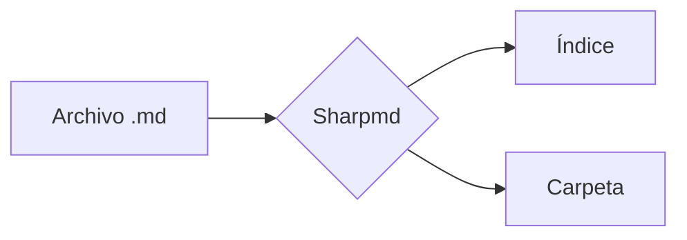
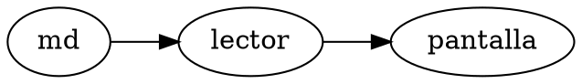

# Sharpmd: documento de prueba

[[toc]]

## Texto

Texto **negrita**, *cursiva*, ~~tachado~~, ==marcado==, ++insertado++, H~2~O, x^2^ y un emoji :rocket:.
Una URL suelta: https://example.com y una nota al pie[^1].

*[HTML]: HyperText Markup Language

El HTML se abrevia así.

[^1]: Texto de la nota al pie.

Links entre archivos: [[notas]], [[Otro|el otro archivo]] y uno que no existe: [[no-existe]].

## Listas

- [x] Tarea hecha
- [ ] Tarea pendiente
- Ítem común

Término
: Su definición

## Alertas

> [!NOTE]
> Una nota informativa.

> [!WARNING]
> Una advertencia.

> Una cita común.

## Código

```python
def saludar(nombre: str) -> str:
    return f"Hola, {nombre}"
```

```js
const suma = (a, b) => a + b;
```

Código `en línea`.

## Tabla

| Campo | Valor |
|---|---|
| Nombre | Sharpmd |
| Precio | $0 |

## Matemática

En línea $E = mc^2$ y en bloque:

$$
\int_0^1 x^2 \, dx = \frac{1}{3}
$$

Un precio como $5 y otro de $10 no deberían romperse.

## Diagrama



## Bloques y Graphviz

::: warning Cuidado
Un bloque con título propio.
:::

::: details Ver más
Contenido plegado.
:::



| Grupo | Dato |
|---|---|
| A | uno |
| ^^ | dos |

## HTML

<details><summary>Desplegable</summary>Contenido oculto.</details>


### Subsección

#### Nivel cuatro

Fin.
