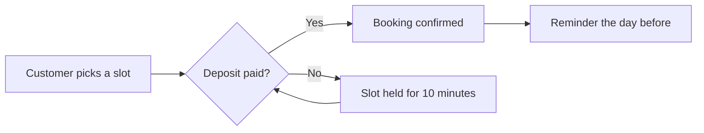

# Booking app launch

What is left before we ship on **Monday the 19th**. Checked items are already in production.

## In this release

- [x] Book an appointment from the phone
- [x] WhatsApp reminder the day before
- [ ] Pay the deposit by card
- [ ] Waiting list when a slot opens up

## Who does what

| Task | Owner | Due | Status |
|---|---|---|---|
| Deposit payment | Sofia | Thursday 15 | In testing |
| Waiting list | Martin | Friday 16 | Started |
| Store copy | Ana | Wednesday 14 | Done |
| Test with five customers | Sofia and Ana | Saturday 17 | Not started |

## How a booking flows

## Risks

> [!WARNING]
> The payment gateway takes up to 48 hours to approve the account. We need to request it today.

## After launch

We track three numbers in the first week: bookings per day, cancellations and late arrivals. See [[roadmap]] for what comes next.
