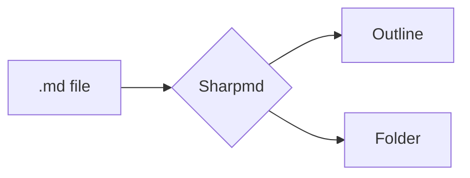
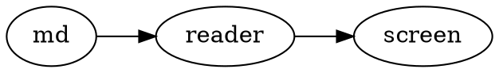

# Sharpmd: test document

[[toc]]

## Text

Text **bold**, *italic*, ~~struck~~, ==marked==, ++inserted++, H~2~O, x^2^ and an emoji :rocket:.
A bare URL: https://example.com and a footnote[^1].

*[HTML]: HyperText Markup Language

HTML gets its abbreviation like this.

[^1]: Text of the footnote.

Links between files: [[notes]], [[Other|the other file]] and one that does not exist: [[missing]].

## Lists

- [x] Done task
- [ ] Pending task
- Plain item

Term
: Its definition

## Callouts

> [!NOTE]
> An informative note.

> [!WARNING]
> A warning.

> A plain quote.

## Code

```python
def greet(name: str) -> str:
    return f"Hello, {name}"
```

```js
const sum = (a, b) => a + b;
```

Code `inline`.

## Table

| Field | Value |
|---|---|
| Name | Sharpmd |
| Price | $0 |

## Math

Inline $E = mc^2$ and as a block:

$$
\int_0^1 x^2 \, dx = \frac{1}{3}
$$

A price like $5 and another of $10 should not break.

## Diagram



## Board

```kanban
## To do
- [ ] Write the docs

## Done
- [x] Ship it
```

## Blocks and Graphviz

::: warning Careful
A block with its own title.
:::

::: details See more
Folded content.
:::



| Group | Item |
|---|---|
| A | one |
| ^^ | two |

## HTML

<details><summary>Dropdown</summary>Hidden content.</details>


### Subsection

#### Level four

The end.
