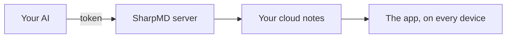

# Connect your AI over MCP

Claude, Codex or any other MCP client can read and write your cloud notes. It reads the notes of the project before a task and writes down what it did.

## Connecting it

1. Sign in to your account. See [The cloud and sharing](cloud-and-sharing.md).
2. Open **Settings** > **AI (MCP)** and create a token.
3. Copy the details right then. The token is not shown again.
4. Press **Copy instructions for your AI** and paste the message into your AI.

The address of the server is `https://sync.sharpmd.app/mcp`. The token goes as `Bearer`.

A token can be limited to one folder: your AI only sees what is in there. The MCP connection is included in the free plan, over the notes you have in the cloud.

## What it can do

| For | Tools |
|---|---|
| Notes | `list_notes`, `list_folders`, `read_note`, `write_note`, `append_note`, `edit_note`, `move_note`, `search_notes`, `note_history` |
| Tasks and comments | `set_task`, `list_comments`, `resolve_comment` |
| Boards | `list_boards`, `create_board`, `update_board`, `add_card`, `add_cards`, `move_card`, `update_card`, `delete_card` |
| Agents | `start_agent`, `update_agent`, `end_agent`, `list_agents` |
| Working guide | `get_guide` |

There are five more for sharing: `list_shares`, `share_note`, `unshare_note`, `create_public_link` and `revoke_public_link`. They exist only for a token created with the sharing permission, which is off by default.

Each write returns a link that opens the note in the app.

## It does not overwrite your work

`edit_note` replaces one exact passage and `set_task` checks one task, without sending the whole note. If the note changed while the AI was working, the two changes are merged line by line. If both touched the same lines, nothing is saved and the AI gets the current text back.

## Asking it for a change

Leave a comment on a block with **Comment for the AI**. The AI reads the open comments, makes the change and closes each one.

## What it does not see

> [!NOTE]
> A folder with a password is closed to the AI. You open it with **Unlock for the AI…**, for as long as you choose.

What is in the trash is not reachable over MCP either.

For flows without an AI, see [Automations and webhooks](automations.md) and the [API reference](api.md).
