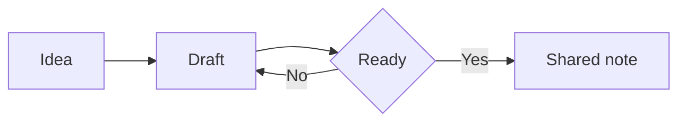
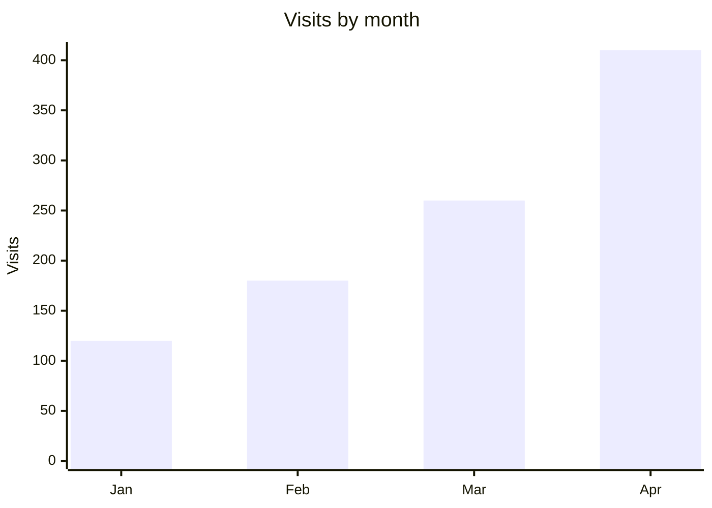

# Diagrams and formulas

## Diagrams

A diagram is a code block named `mermaid`. SharpMD draws it:



That drawing comes from this text:

````text

````

To add one, pick **Diagram** in the block menu. While editing, a click on the diagram opens its editor: the drawing next to the code, templates, pieces you add with a button and color palettes. If there is an error, it explains it and marks the line.

A `dot` block is drawn with Graphviz.

## Charts

A bar, line or pie chart is also a `mermaid` block:



To build one from a table, click a cell while editing and pick **Chart** in the table bar. You choose the type, the column with the labels and the one with the values, and the chart lands below the table. It reads numbers like `1,234.5`, `$ 900` and `12 %`, and leaves out the totals row. The table stays as it is. If you change a number later, chart it again.

## Formulas

Formulas are written in LaTeX and drawn by KaTeX. Inside a line they go between dollar signs: energy is $E = mc^2$.

In a block of their own they go between two pairs of signs:

$$
x = \frac{-b \pm \sqrt{b^2 - 4ac}}{2a}
$$

To add one, pick **Formula** in the block menu. The editor shows it as you type.

## Going further

The **Explorable diagrams** tool lets you walk through a flowchart: zoom, drag, find a node and see what reaches it. Turn it on in **Settings** > **Tools**. See [Tools and plugins](tools-and-plugins.md).

With [dictation](voice.md) you can also build formulas and diagrams by speaking.
