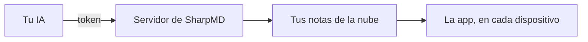

# Conectar tu IA por MCP

Claude, Codex o cualquier otro cliente de MCP puede leer y escribir tus notas de la nube. Lee las notas del proyecto antes de una tarea y deja escrito lo que hizo.

## Conectarla

1. Entrá a tu cuenta. Está en [La nube y compartir](cloud-and-sharing.md).
2. Abrí **Ajustes** > **IA (MCP)** y creá un token.
3. Copiá los datos en ese momento. El token no se vuelve a mostrar.
4. Tocá **Copiar instrucciones para tu IA** y pegá el mensaje en tu IA.

La dirección del servidor es `https://sync.sharpmd.app/mcp`. El token va como `Bearer`.

Un token puede limitarse a una carpeta: tu IA solo ve lo que hay ahí. La conexión por MCP está incluida en el plan gratis, sobre las notas que tengas en la nube.

## Qué puede hacer

| Para | Herramientas |
|---|---|
| Notas | `list_notes`, `list_folders`, `read_note`, `write_note`, `append_note`, `edit_note`, `move_note`, `search_notes`, `note_history` |
| Tareas y comentarios | `set_task`, `list_comments`, `resolve_comment` |
| Tableros | `list_boards`, `create_board`, `update_board`, `add_card`, `add_cards`, `move_card`, `update_card`, `delete_card` |
| Agentes | `start_agent`, `update_agent`, `end_agent`, `list_agents` |
| Guía de trabajo | `get_guide` |

Hay cinco más para compartir: `list_shares`, `share_note`, `unshare_note`, `create_public_link` y `revoke_public_link`. Solo existen para un token creado con el permiso de compartir, que viene apagado.

Cada escritura devuelve un enlace que abre la nota en la app.

## No pisa lo tuyo

`edit_note` reemplaza un pasaje exacto y `set_task` marca una tarea, sin mandar la nota entera. Si la nota cambió mientras la IA trabajaba, los dos cambios se juntan renglón por renglón. Si tocaron los mismos renglones, no se guarda nada y la IA recibe el texto actual.

## Pedirle un cambio

Dejá un comentario sobre un bloque con **Comentar para la IA**. La IA lee los comentarios abiertos, hace el cambio y cierra cada uno.

## Lo que no ve

> [!NOTE]
> Una carpeta con contraseña queda cerrada para la IA. La abrís con **Desbloquear para la IA…**, por el tiempo que elijas.

Lo que está en la papelera tampoco se alcanza por MCP.

Para flujos sin IA, mirá [Automatizaciones y webhooks](automations.md) y la [Referencia de la API](api.md).
