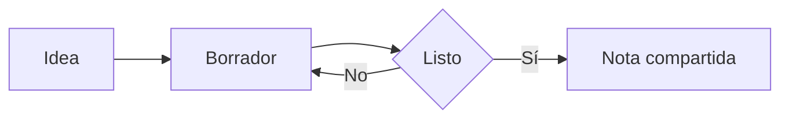

# Diagramas y fórmulas

## Diagramas

Un diagrama es un bloque de código con el nombre `mermaid`. SharpMD lo dibuja:



Ese dibujo sale de este texto:

````text

````

Para sumar uno, elegí **Diagrama** en el menú de bloques. Editando, un clic sobre el diagrama abre su editor: el dibujo al lado del código, plantillas, piezas que se agregan con un botón y paletas de color. Si hay un error, lo explica y marca el renglón.

Un bloque `dot` se dibuja con Graphviz.

## Fórmulas

Las fórmulas se escriben en LaTeX y las dibuja KaTeX. Dentro de un renglón van entre signos de pesos: la energía es $E = mc^2$.

En un bloque aparte van entre dos pares de signos:

$$
x = \frac{-b \pm \sqrt{b^2 - 4ac}}{2a}
$$

Para sumar una, elegí **Fórmula** en el menú de bloques. El editor la muestra mientras escribís.

## Para ir más lejos

La herramienta **Diagramas explorables** deja recorrer un diagrama de flujo: acercar, arrastrar, buscar un nodo y ver qué llega a él. Se prende en **Ajustes** > **Herramientas**. Está en [Herramientas y plugins](tools-and-plugins.md).

Con el [dictado](voice.md) también se arman fórmulas y diagramas hablando.
